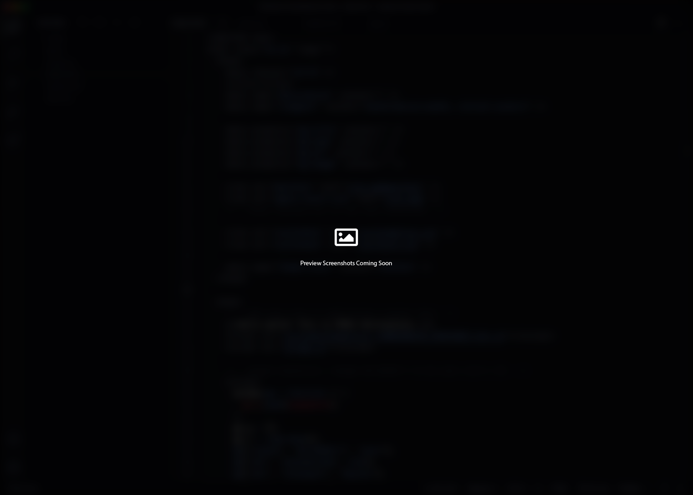

# Neptune

> This theme is in early development stage and is subject to change frequently. You can participate in its development by contributing to the theme or sharing feedback with me!

See the **[Changelog](https://github.com/pascalcodes/neptune-theme/blob/main/CHANGELOG.md)** for the latest changes made to the theme.

 

### Installation

---

1. In Visual Studio Code, open the Extensions panel in your sidebar
2. Search for Neptune
3. Click Install
4. Select Color Theme

 

### Feedback

---

To report an issue or make a suggestion, please [open an issue.](https://github.com/pascalcodes/neptune-theme/issues)

 

### Contributing

---

To contribute to this theme, please read the [contribution instructions.](https://github.com/pascalcodes/neptune-theme)

 

### Author

---

This theme is created and maintainted by [Pascal](https://instagram.com/pascalcodes)
